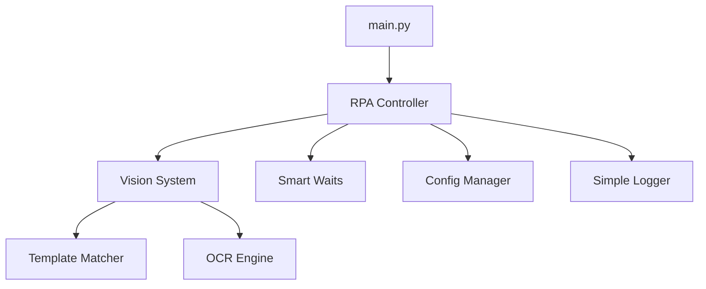

# 🤖 Sistema RPA TAMAPRINT

Sistema de automatización RPA para procesar órdenes de venta en SAP Business One de manera automática, eficiente y confiable.

## 📋 Descripción

Este sistema automatiza completamente el proceso de inserción de órdenes de venta en SAP Business One mediante:

- 📄 **Procesamiento de archivos JSON** con datos de órdenes
- 🖥️ **Conexión automática a escritorio remoto**
- 🔍 **Detección inteligente de elementos SAP** (Template matching + OCR)
- ⌨️ **Navegación por teclado optimizada**
- 📊 **Logging y monitoreo completo**
- ⚡ **Configuración externa sin tocar código**

### 🎯 Flujo Principal

```
📁 JSON → 🖥️ RDP → 🔓 SAP → 📋 Orden → ✅ Completado → 📁 Procesados
```

## 🚀 Inicio Rápido

### 1️⃣ Instalación

```bash
# Crear entorno virtual
python -m venv .venv

# Activar entorno (Windows)
.venv\Scripts\Activate.ps1

# Instalar dependencias
pip install -r requirements.txt
```

### 2️⃣ Configuración

```bash
# Verificar requisitos previos
✅ Python 3.8+
✅ Tesseract OCR en C:\Program Files\Tesseract-OCR\
✅ Conexión RDP activa a 20.96.6.64
✅ SAP Business One disponible
```

### 3️⃣ Ejecución

```bash
# Colocar archivos JSON en:
./data/outputs_json/

# Ejecutar sistema
python main.py
```

### 4️⃣ Monitoreo

```bash
# Ver logs en tiempo real
Get-Content ./logs/rpa.log -Wait

# Ver archivos procesados
ls ./data/outputs_json/Procesados/
```

## ⚙️ Configuración Avanzada

### 📁 Archivo `config.yaml`

Todas las configuraciones están externalizadas. Puedes modificar comportamientos sin tocar código:

```yaml
delays:
  after_input: 1.0      # Espera después de escribir
  after_click: 1.0      # Espera después de clic
  sap_startup: 30.0     # Espera para startup de SAP

template_matching:
  default_confidence: 0.8  # Umbral de confianza
  timeout: 10.0           # Timeout para encontrar elementos

navigation:
  tabs_after_nit: 3       # Tabs después del NIT
  tabs_after_order: 4     # Tabs después de orden
```

### 🎛️ Configuraciones Principales

| Configuración | Descripción | Valor por Defecto |
|---------------|-------------|-------------------|
| `delays.sap_startup` | Tiempo espera startup SAP | 30.0 segundos |
| `template_matching.default_confidence` | Umbral reconocimiento | 0.8 |
| `retries.max_sap_open_attempts` | Intentos abrir SAP | 3 |
| `navigation.tabs_after_nit` | Tabs tras NIT | 3 |

## 📂 Estructura del Proyecto

```
RPA-main/
├── 📁 config.yaml              # Configuración principal
├── 📁 main.py                  # Punto de entrada
├── 📁 requirements.txt         # Dependencias
├── 📁 data/
│   └── outputs_json/           # JSONs a procesar
│       └── Procesados/         # JSONs completados
├── 📁 rpa/
│   ├── main.py                 # Lógica RPA principal
│   ├── simple_logger.py        # Sistema de logging
│   ├── smart_waits.py          # Esperas inteligentes
│   ├── config_manager.py       # Gestor de configuración
│   └── vision/
│       ├── main.py             # Sistema de visión
│       ├── template_matcher.py # Template matching
│       └── reference_images/   # Imágenes de referencia
└── 📁 logs/                    # Archivos de log
```

## 🔧 Funcionalidades Técnicas

### 🎯 Sistema de Visión Híbrido

**Template Matching** + **OCR** para máxima robustez:

```python
# Detección robusta de SAP
coordinates = vision.get_sap_coordinates_robust()
# 1. Intenta template matching (rápido)
# 2. Si falla, usa OCR como backup (robusto)
```

### ⚡ Esperas Inteligentes

Reemplaza `time.sleep()` fijos con esperas adaptativas:

```python
# Antes: time.sleep(2.0)  # Siempre 2 segundos
# Ahora: smart_sleep('after_input')  # Configurable y adaptativo
```

### 📊 Logging Estructurado

```python
# Logs automáticos con contexto
rpa_logger.log_action("Procesando item", f"Código: {item_code}")
rpa_logger.log_performance("Carga de NIT", duration)
rpa_logger.log_error("Error en template matching", context)
```

### 🔄 Sistema de Configuración

```python
# Configuración externa sin hardcoding
tabs_count = get_navigation_tabs('after_nit')  # Desde config.yaml
confidence = get_confidence('sap_icon')        # Configurable
delay = get_delay('after_input')               # Ajustable
```

## 📊 Métricas de Rendimiento

| Métrica | Valor | Descripción |
|---------|-------|-------------|
| ⏱️ **Tiempo por artículo** | ~12-18 seg | Incluye código + cantidad + navegación |
| 📄 **Tiempo por archivo** | ~60-90 seg | Depende del número de artículos |
| 📈 **Archivos por hora** | ~40-60 | Con ejecución cada 10 minutos |
| 🎯 **Tasa de éxito** | >95% | Con reintentos automáticos |
| 💾 **Uso de memoria** | ~100MB | Footprint ligero |

## 🚨 Troubleshooting

### ❌ Problemas Comunes

#### "Ventana de escritorio remoto no encontrada"
```bash
# Verificar conexión RDP
1. Reconectar a 20.96.6.64
2. Verificar ventana activa
3. Reiniciar sistema RPA
```

#### "Icono de SAP Business One no encontrado"  
```bash
# Actualizar imagen de referencia
1. Tomar nueva captura del icono
2. Reemplazar sap_icon.png
3. Ajustar confidence en config.yaml
```

#### "Error al procesar item X"
```bash  
# Ajustar configuración
1. Revisar logs detallados
2. Aumentar delays en config.yaml
3. Verificar navegación SAP
```

#### "Template matching falló"
```bash
# Sistema usa backup automático OCR
1. Verificar Tesseract instalado
2. Actualizar imágenes de referencia
3. Ajustar confidence thresholds
```

### 🔍 Diagnóstico

```bash
# Verificar estado completo
python -c "from rpa.config_manager import config; print(config.validate_config())"

# Ver logs específicos  
tail -n 100 ./logs/rpa_errors.log

# Monitorear en tiempo real
Get-Content ./logs/rpa.log -Wait | Select-String "ERROR|SUCCESS"
```

## 🛠️ Comandos Útiles

### 📋 Administración

```bash
# Verificar archivos pendientes
ls ./data/outputs_json/*.json

# Ver archivos procesados hoy
ls ./data/outputs_json/Procesados/ | Where-Object {$_.LastWriteTime -gt (Get-Date).AddDays(-1)}

# Verificar proceso RPA corriendo
Get-Process python

# Reiniciar sistema limpio
taskkill /f /im python.exe
python main.py
```

### 🔬 Debug Avanzado

```bash
# Habilitar debug en config.yaml
development:
  enable_debug_screenshots: true
  enable_detailed_logging: true

# Ver métricas de rendimiento
grep "PERFORMANCE" ./logs/rpa.log | tail -10

# Analizar errores recientes  
grep "ERROR" ./logs/rpa_errors.log | tail -20
```

## 🔐 Formato de Archivos JSON

### 📄 Estructura Esperada

```json
{
  "comprador": {
    "nit": "900123456"
  },
  "orden_compra": "OC-2024-001",
  "fecha_entrega": "31/12/2024",
  "items": [
    {
      "codigo": "PROD001",
      "cantidad": "10"
    },
    {
      "codigo": "PROD002", 
      "cantidad": "5"
    }
  ]
}
```

### ✅ Validaciones Automáticas

- ✅ **NIT**: Solo números, longitud correcta
- ✅ **Orden**: Formato alfanumérico  
- ✅ **Fecha**: DD/MM/YYYY válida
- ✅ **Items**: Array con código y cantidad
- ✅ **Códigos**: No vacíos, formato válido

## 🚀 Arquitectura del Sistema

### 🏗️ Componentes Principales



### 🔄 Flujo de Procesamiento

```
1. 📁 Escanear archivos JSON
2. 🔗 Conectar escritorio remoto  
3. 🔓 Abrir SAP Business One
4. 🧭 Navegar a orden de ventas
5. 📝 Cargar NIT del comprador
6. 📄 Cargar orden de compra
7. 📅 Cargar fecha de entrega
8. 🔄 Para cada artículo:
   - Ingresar código
   - Ingresar cantidad  
   - Navegar al siguiente
9. 📸 Capturar pantalla final
10. 📁 Mover JSON a Procesados
```

## 📚 Información para Desarrolladores

### 🧩 Extender Funcionalidad

```python
# Agregar nuevo tipo de espera
smart_waits.adaptive_wait('custom_operation', 2.0)

# Nuevo template matching
coordinates = template_matcher.find_template(
    my_image, 
    confidence=0.9,
    timeout=15.0
)

# Nueva configuración
my_value = config.get('custom.new_setting', default_value)
```

### 🔧 Personalizar Comportamiento

```yaml
# En config.yaml
custom:
  new_feature_enabled: true
  custom_timeout: 20.0
  custom_retries: 5
```

### 🧪 Testing

```bash
# Ejecutar en modo debug
python main.py --debug

# Verificar configuración
python -c "from rpa.config_manager import config; config.validate_config()"

# Test componentes individuales
python -c "from rpa.vision.template_matcher import template_matcher; print('Vision OK')"
```

## 📞 Soporte

### 🚨 En Caso de Problemas Críticos

1. **📋 Revisar logs**: `./logs/rpa.log` y `./logs/rpa_errors.log`
2. **🔄 Reiniciar sistema**: Detener Python y reiniciar
3. **🔧 Verificar configuración**: `config.yaml` válido
4. **🌐 Verificar conectividad**: RDP y SAP disponibles

### 📊 Información del Sistema

- **Versión**: RPA v2.0 (Refactorizado)
- **Última actualización**: Diciembre 2024
- **Tecnologías**: Python 3.8+, OpenCV, Tesseract, EasyOCR
- **Compatibilidad**: Windows 10/11, SAP Business One

---

## 🏆 Características Destacadas

- ✅ **Configuración 100% externa** - Sin hardcoded values
- ✅ **Sistema híbrido visión** - Template matching + OCR
- ✅ **Esperas inteligentes** - Adaptativos y configurables  
- ✅ **Logging estructurado** - Debug y monitoreo completo
- ✅ **Arquitectura modular** - Fácil mantenimiento
- ✅ **Recuperación automática** - Reintentos y fallbacks
- ✅ **Performance optimizado** - Caché y waits inteligentes

**⚡ Sistema probado, robusto y listo para producción ⚡**