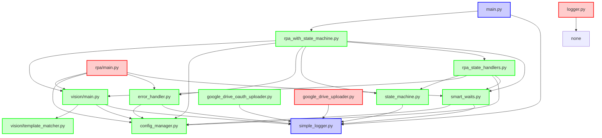
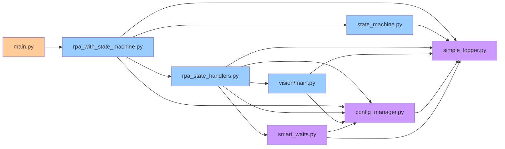
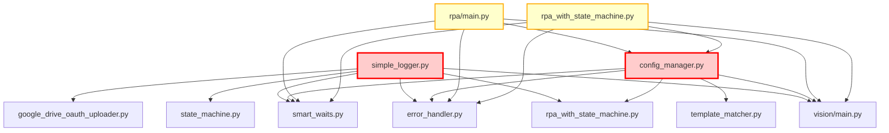
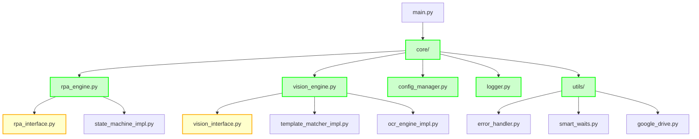
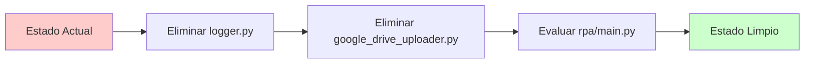
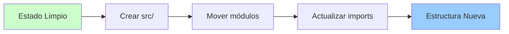
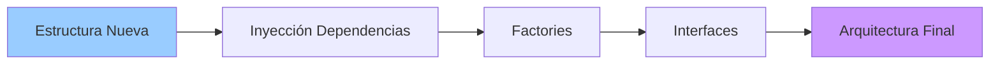

# 🗺️ DIAGRAMA DE DEPENDENCIAS - RPA TAMAPRINT

## 📊 DIAGRAMA PRINCIPAL DE DEPENDENCIAS

## 🔄 FLUJO DE DEPENDENCIAS CRÍTICAS

## 🚨 DEPENDENCIAS PROBLEMÁTICAS

## 🎯 ARQUITECTURA OBJETIVO

## 📊 MÉTRICAS DE COMPLEJIDAD

### Acoplamiento por Módulo:

| Módulo | Dependencias Salientes | Dependencias Entrantes | Complejidad |
|--------|----------------------|----------------------|-------------|
| `simple_logger` | 0 | 15+ | **ALTA** |
| `config_manager` | 0 | 10+ | **ALTA** |
| `vision/main` | 3 | 8+ | **MEDIA** |
| `rpa_with_state_machine` | 8 | 3 | **MEDIA** |
| `error_handler` | 2 | 4 | **BAJA** |
| `state_machine` | 1 | 3 | **BAJA** |

### Redundancias Identificadas:

1. **Sistemas de Logging**: 2 implementaciones
2. **Implementaciones RPA**: 2 versiones
3. **Google Drive**: 2 uploaders
4. **Tests**: Dispersos en múltiples ubicaciones

## 🔧 PLAN DE REFACTORIZACIÓN VISUAL

### Fase 1: Eliminación de Redundancias

### Fase 2: Reestructuración

### Fase 3: Optimización

## 📝 NOTAS DE IMPLEMENTACIÓN

### Prioridades de Refactorización:

1. **CRÍTICO**: Eliminar `logger.py` y `google_drive_uploader.py`
2. **ALTO**: Decidir entre `rpa/main.py` y `rpa_with_state_machine.py`
3. **MEDIO**: Reducir acoplamiento de `simple_logger` y `config_manager`
4. **BAJO**: Implementar interfaces y factories

### Riesgos Identificados:

- **Alto**: Cambios en `simple_logger` afectan a 15+ módulos
- **Medio**: Eliminación de `rpa/main.py` puede romper tests
- **Bajo**: Reestructuración de directorios es mecánica

---

**Última actualización**: Diciembre 2024
